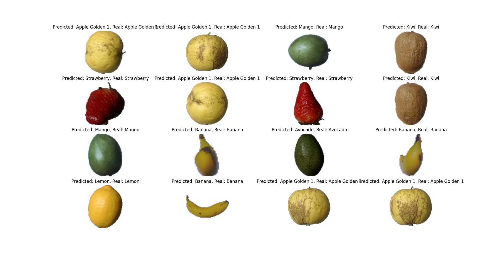

# Fruits360

## Description
This is an implementation of a model which classifies fruit images of size (100, 100) into 8 classes. I work on a subset of the Fruits360 dataset (created by the make_limited_datasets.py script) by only taking 8 of the 131 classes (which reduces the size of the dataset from 90486 images to 5112).

## Approach
I used the approach from the Udemy course [Advanced Computer Vision](https://www.udemy.com/course/advanced-computer-vision), which suggests using the VGG16 with my own classification layer. I use the pretrained weights for the rest of the network, which acts as a feature extractor.

## Results
It achieves 100% over the test set in only one training epoch. 

